<div align="center">

<a href="https://proven-id.vercel.app">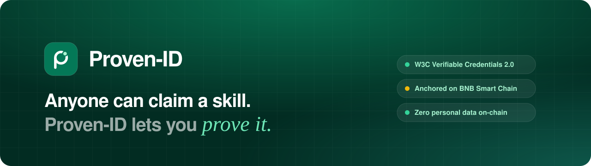</a>

<h3>Verified professional identity for the on-chain era</h3>

<p>
Turn claims about your skills, experience, projects and achievements into<br>
<b>W3C Verifiable Credentials</b> signed by a real issuer and <b>anchored on BNB Smart Chain</b>,<br>
which anyone can check, even without our server.
</p>

<p>
<a href="https://proven-id.vercel.app"></a>
<a href="https://proven-id.vercel.app/p/arya-pratama"></a>
<a href="https://testnet.bscscan.com/address/0xcCbC054C107405F0BB8d7adCE3f780914e9Bf0d4"></a>
</p>

<p>
<a href="https://github.com/MrPrinceAli/proven/actions/workflows/ci.yml"></a>
<a href="LICENSE"></a>


<a href="CONTRIBUTING.md"></a>
</p>

<p>


</p>

<b><a href="https://proven-id.vercel.app">Live demo</a></b> ·
<a href="#-try-it-in-60-seconds">Try it</a> ·
<a href="#-how-it-works">How it works</a> ·
<a href="#-architecture">Architecture</a> ·
<a href="#-getting-started">Getting started</a> ·
<a href="docs/">Docs</a>

<sub>Built for the <b>Indonesia Web3 Hackathon</b> by BNB Chain · track <b>Consumer Apps</b></sub>

</div>

---

## ✨ Why Proven-ID?

Anyone can write _"Expert in Solidity"_ on a CV. Recruiters, campuses and clients can't tell which claims are real.
**Proven-ID** links every claim to evidence, has a trusted issuer sign it, and anchors a fingerprint on-chain. Verifying a claim takes one click instead of a phone call.

<table>
<tr>
<td width="33%" valign="top">

### 🔏 Verifiable by anyone

Each credential is a W3C VC 2.0 / Open Badges 3.0 document, signed with EIP-712. Its `sha256(JCS(vc))` is anchored to `CredentialRegistry` on BNB Smart Chain. The **independent verifier** re-computes the hash in the browser and reads the chain directly.

</td>
<td width="33%" valign="top">

### 🛡️ Private by design

**Zero personal data on-chain**: only `bytes32` hashes, addresses, numbers and booleans, enforced by tests. Evidence files are encrypted with AES-256-GCM and come with a SHA-256 chain of custody. Names live off-chain only.

</td>
<td width="33%" valign="top">

### 🤖 Honest AI

Claude helps you write summaries, tailor your CV and classify evidence, using **only your own data**. Deterministic guardrails stop invented skills: _"Skill detected — evidence not found."_ AI never grants _Verified_. Only issuers do.

</td>
</tr>
</table>

## 🚀 Try it in 60 seconds

No wallet needed. Demo mode creates a sandbox account just for you.

1. Open **[proven-id.vercel.app](https://proven-id.vercel.app)**.
2. Click **Coba sebagai User**. You get a profile (e.g. _Salsa Maharani_) with claims, an encrypted certificate and a pending verification request.
3. Click **Beralih ke Issuer demo** and approve the request as _XYZ Community_. This sends a **real transaction** on BSC Testnet.
4. Switch back to the user. The achievement now shows **Terverifikasi** with a QR code, a public verification page and an on-chain proof.
5. Open the verification page and press **Periksa ulang** to verify independently, straight from the blockchain.

Or browse the sample profile: **[/p/arya-pratama](https://proven-id.vercel.app/p/arya-pratama)**.

## 📸 Screenshots

<table>
<tr>
<td colspan="2">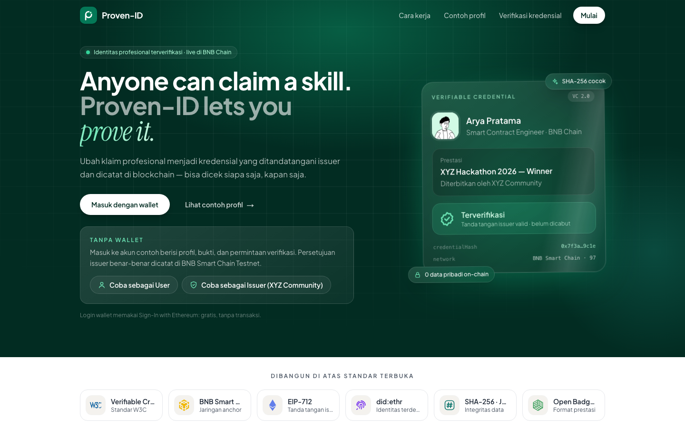</td>
</tr>
<tr>
<td width="50%">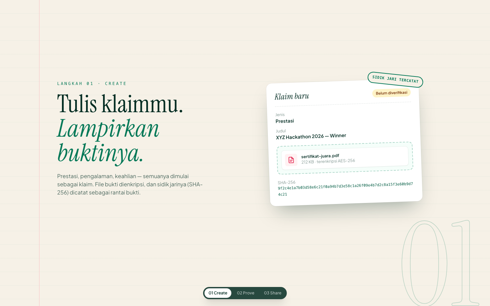<br><sub><b>01 Create</b>: claim + encrypted evidence + SHA-256</sub></td>
<td width="50%">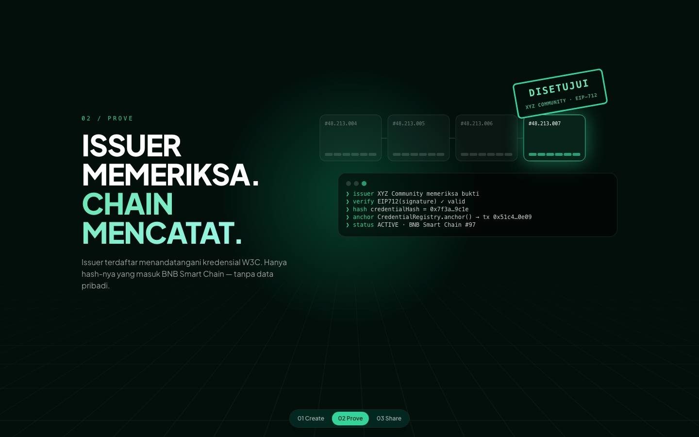<br><sub><b>02 Prove</b>: issuer signs, chain records</sub></td>
</tr>
<tr>
<td width="50%">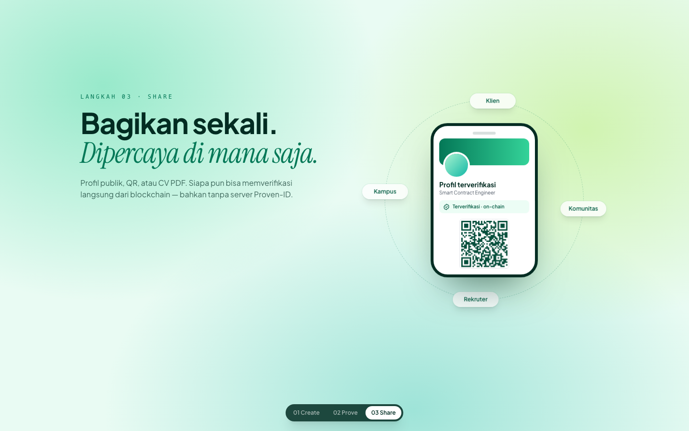<br><sub><b>03 Share</b>: profile, QR, CV, verifiable anywhere</sub></td>
<td width="50%">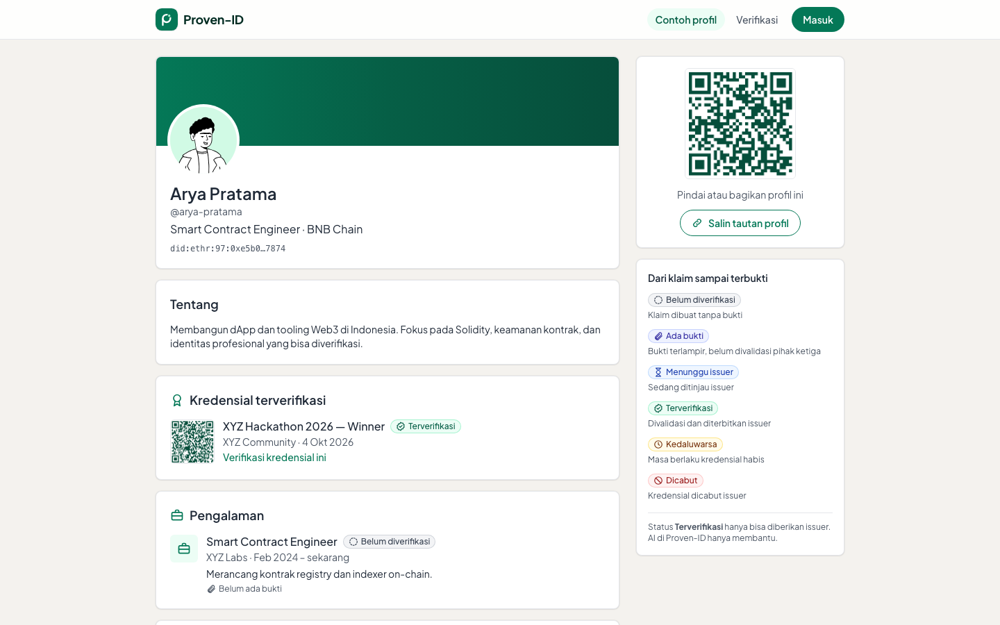<br><sub>Public profile with verified credentials + QR</sub></td>
</tr>
<tr>
<td width="50%">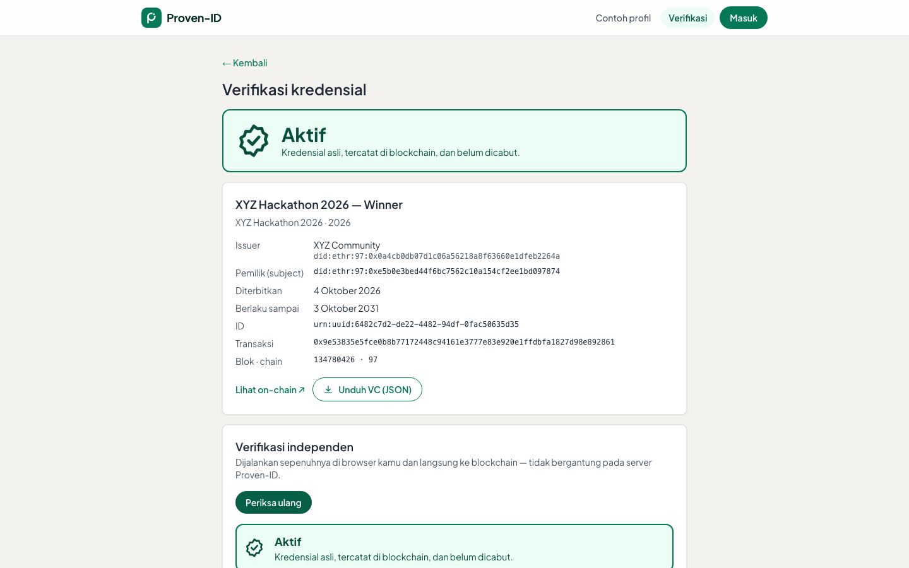<br><sub>Verification page: on-chain status + independent check</sub></td>
<td width="50%">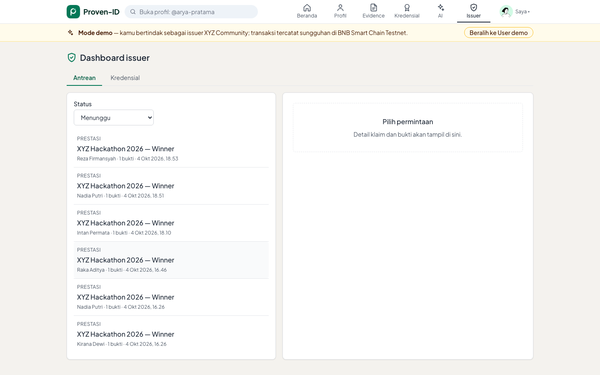<br><sub>Issuer dashboard: review evidence, approve, revoke</sub></td>
</tr>
<tr>
<td colspan="2" align="center">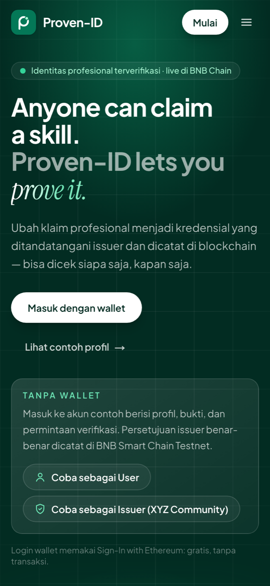<br><sub>Mobile first</sub></td>
</tr>
</table>

## 🧭 How it works

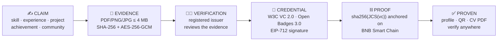

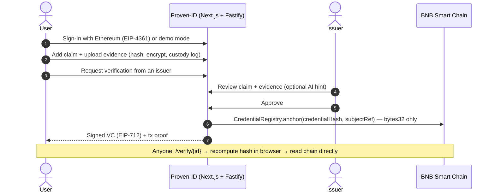

| Status                                  | Meaning                                                        |
| --------------------------------------- | -------------------------------------------------------------- |
| `UNVERIFIED` · `CLAIM_WITHOUT_EVIDENCE` | Claimed, no proof yet                                          |
| `EVIDENCE_ATTACHED`                     | Evidence linked, not yet reviewed by a third party             |
| `PENDING_ISSUER`                        | Waiting for the issuer                                         |
| `VERIFIED`                              | Credential issued by a registered issuer and anchored on-chain |
| `EXPIRED` · `REVOKED`                   | Past `validUntil`, or revoked on-chain by the issuer           |

## 🏗️ Architecture

Everything runs in the cloud on free tiers. No Docker, no servers to babysit.

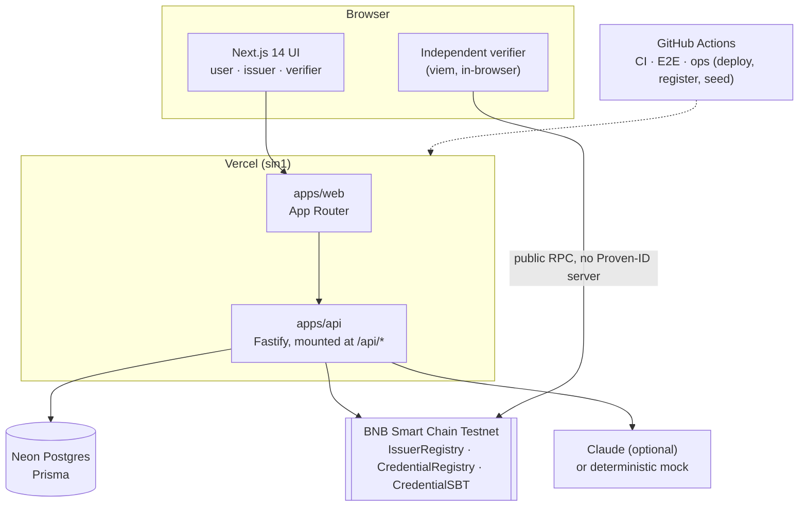

| Package                                    | What's inside                                                                                |
| ------------------------------------------ | -------------------------------------------------------------------------------------------- |
| [`apps/web`](apps/web)                     | Next.js 14 App Router: landing, user dashboard, issuer dashboard, public profiles, verifier  |
| [`apps/api`](apps/api)                     | Fastify 4: SIWE auth, profiles, evidence vault, issuer flow, verification, AI, chain adapter |
| [`packages/contracts`](packages/contracts) | Foundry: `IssuerRegistry`, `CredentialRegistry`, `CredentialSBT` + typed ABIs                |
| [`packages/vc`](packages/vc)               | Isomorphic VC toolkit: schema, JCS + SHA-256, EIP-712, `verifyVC`                            |
| [`packages/ai`](packages/ai)               | LLM client (Claude / mock), versioned prompts, guardrails, eval set                          |
| [`packages/db`](packages/db)               | Prisma schema + migrations (Postgres 16)                                                     |
| [`packages/ui`](packages/ui)               | "Ledger & Seal" design system: green theme, status badges, icons                             |

### Deployed contracts (BSC Testnet · chainId 97)

| Contract             | Address                                                                                                                        |
| -------------------- | ------------------------------------------------------------------------------------------------------------------------------ |
| `IssuerRegistry`     | [`0x69d3961b65dcfff10bf7a71d93375cAe4bE70dC3`](https://testnet.bscscan.com/address/0x69d3961b65dcfff10bf7a71d93375cAe4bE70dC3) |
| `CredentialRegistry` | [`0xcCbC054C107405F0BB8d7adCE3f780914e9Bf0d4`](https://testnet.bscscan.com/address/0xcCbC054C107405F0BB8d7adCE3f780914e9Bf0d4) |
| `CredentialSBT`      | [`0x5AaD146A14357a1ad91bBFEecB065e173cFc2811`](https://testnet.bscscan.com/address/0x5AaD146A14357a1ad91bBFEecB065e173cFc2811) |

## 🔐 Golden rules

1. **No PII on-chain.** Only `bytes32`, `address`, `uint`, `bool`. A system-level E2E test scans every registry log.
2. **AI never invents.** No skill or experience may appear that isn't in the user's own data.
3. **The issuer is the authority.** _Verified_ only comes from an issuer-signed credential.
4. **Private keys stay on the server.** Never in the browser or in `NEXT_PUBLIC_*`.
5. **Deterministic hashes.** `credentialHash = sha256(JCS(vc without proof))`, with golden test vectors.
6. **Human in the loop.** AI output is never saved without the user's confirmation.

## 🧪 Quality

| Suite                           | Tests | Notes                                                                                              |
| ------------------------------- | ----: | -------------------------------------------------------------------------------------------------- |
| Smart contracts (Foundry)       |    46 | 100% coverage, fuzz tests on `CredentialRegistry`                                                  |
| API (Vitest + Postgres + Anvil) |   129 | ~96% coverage of services, real chain in CI                                                        |
| VC toolkit + AI guardrails      |    36 | Golden vectors, prompt-injection and negative datasets                                             |
| Web unit                        |    13 | CV model, explorer helpers, avatar route                                                           |
| End-to-end (Playwright)         |    15 | Full core loop via UI, independent verify with the API down, tampering, revoke, privacy, demo mode |

Every pull request runs lint, typecheck, unit + integration tests (Postgres + Anvil), Foundry and Playwright on GitHub Actions.

## 🛠️ Getting started

You don't have to run anything locally. CI and the Vercel preview check every change. To hack on it:

```bash
# Node 22, pnpm 9 (corepack enable), Foundry, Postgres 16
pnpm install
cp .env.example .env            # fill in values (never commit .env)
pnpm db:migrate && pnpm db:seed # local database + demo data
pnpm dev                        # web on :3000, API under /api/*

pnpm lint && pnpm typecheck && pnpm test
pnpm test:contracts             # Foundry
anvil & pnpm contracts:deploy:local
pnpm e2e                        # Playwright (needs Postgres + Anvil)
```

Deploying your own instance on BSC Testnet: see **[docs/DEPLOY-BSC-TESTNET.md](docs/DEPLOY-BSC-TESTNET.md)**.

## 📚 Documentation

| Doc                                                 |                                                          |
| --------------------------------------------------- | -------------------------------------------------------- |
| [PROVEN-WAVES.md](docs/PROVEN-WAVES.md)             | Product spec (§S1–§S17) and delivery plan in waves W0–W8 |
| [DECISIONS.md](docs/DECISIONS.md)                   | Architecture decision log (D-001 …)                      |
| [PROGRESS.md](docs/PROGRESS.md)                     | What shipped, wave by wave                               |
| [DEPLOY-BSC-TESTNET.md](docs/DEPLOY-BSC-TESTNET.md) | Wallets, secrets, contracts, Vercel, seed                |
| [DEMO-SCRIPT.md](docs/DEMO-SCRIPT.md)               | 3-minute pitch demo script                               |

<sub>Docs are written in Bahasa Indonesia; code and comments are in English.</sub>

## 🗺️ Roadmap

- [x] SIWE login · encrypted evidence vault · issuer flow · on-chain anchoring · revocation
- [x] Independent in-browser verification · public profiles · QR · verified CV PDF
- [x] Honest AI assistant with guardrails · demo mode for judges
- [ ] Soulbound credential mint (`CredentialSBT`) from the UI
- [ ] Multi-issuer onboarding and issuer reputation
- [ ] Profile photo upload · recruiter-only visibility
- [ ] BNB Smart Chain mainnet / opBNB

## 🤝 Contributing

Contributions are welcome! Please read **[CONTRIBUTING.md](CONTRIBUTING.md)**. For security issues, see **[SECURITY.md](SECURITY.md)**.

## 🙏 Credits

Avatars: [DiceBear](https://www.dicebear.com/) "Notionists" by Zoish (CC0 1.0) · Standard logos: [Simple Icons](https://simpleicons.org/) (CC0 1.0) · Fonts: Plus Jakarta Sans (Tokotype, OFL), Instrument Serif (OFL).
All people shown in the demo (Arya Pratama, Salsa Maharani, …) are fictional.

## 📄 License

[MIT](LICENSE) © 2026 MrPrinceAli and Proven-ID contributors.

<div align="center"><sub>Made with 💚 in Indonesia · <a href="https://proven-id.vercel.app">proven-id.vercel.app</a></sub></div>
